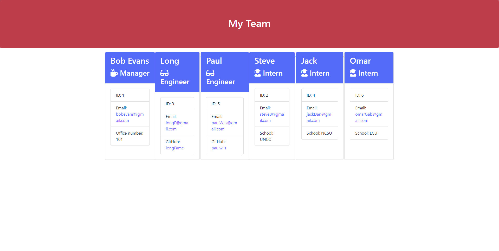
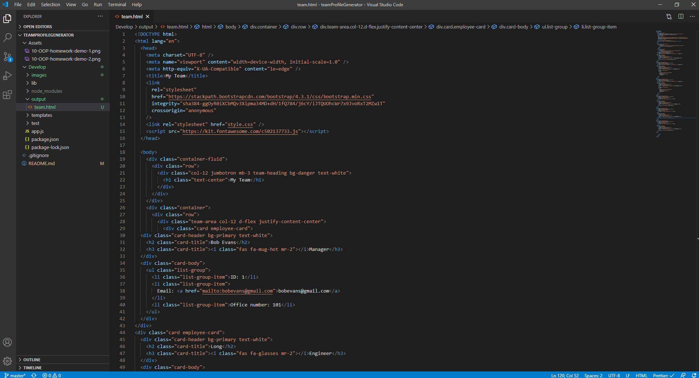

# Unit 10 OOP Homework: Template Engine - Employee Summary

A software engineering team is generated from a command line application. User is asked to input Manger's information along with their team members. Once information is gathered, an HTML webpage will display the summaries for each team member.

Here is the link to the Github repository. https://github.com/phakpa/teamProfileGenerator

images below ------------------------------------------------------------------------------

